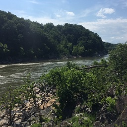
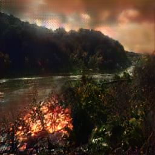

# Hellify

CycleGAN model trained on
images of landscapes and fires and a simple script to run the generator.

## Setup
  - `pip install -r "requirements.txt"`
  - `python generate.py [input path]`

## Acknowledgements
  - Made with the [PyTorch implementation of CycleGAN](https://github.com/junyanz/pytorch-CycleGAN-and-pix2pix)